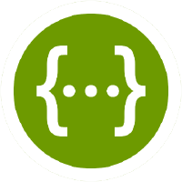
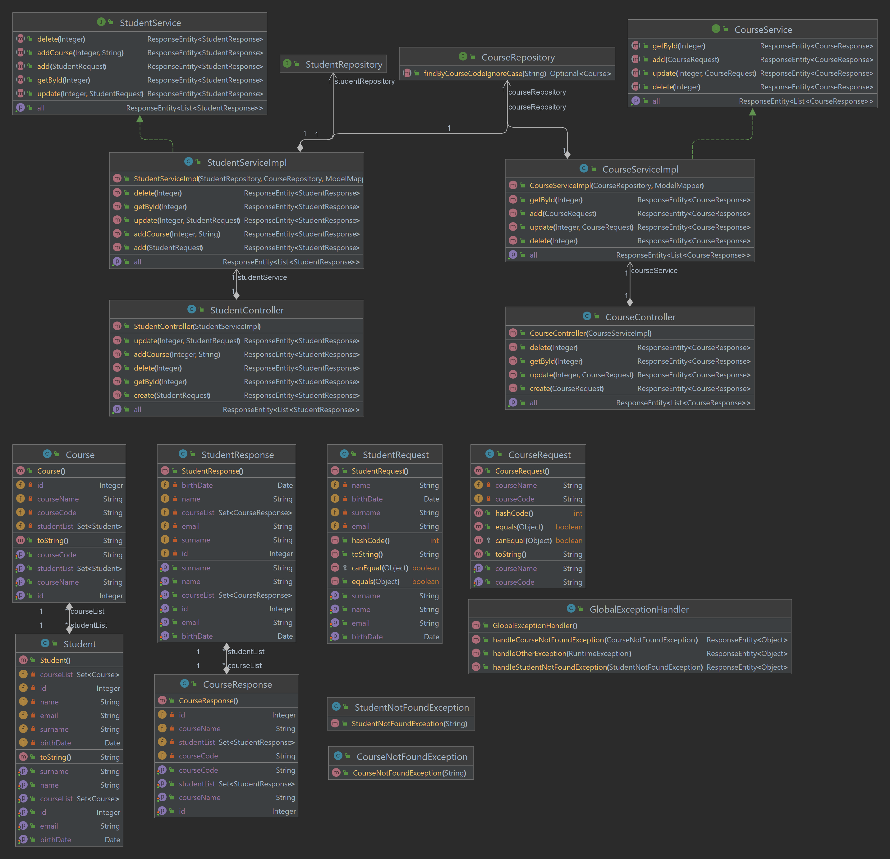
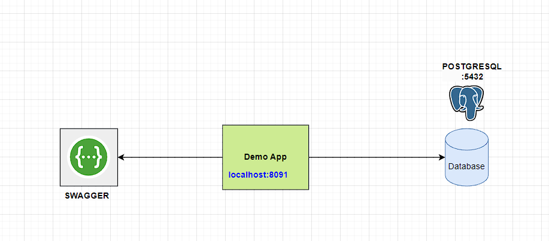
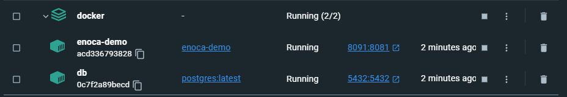
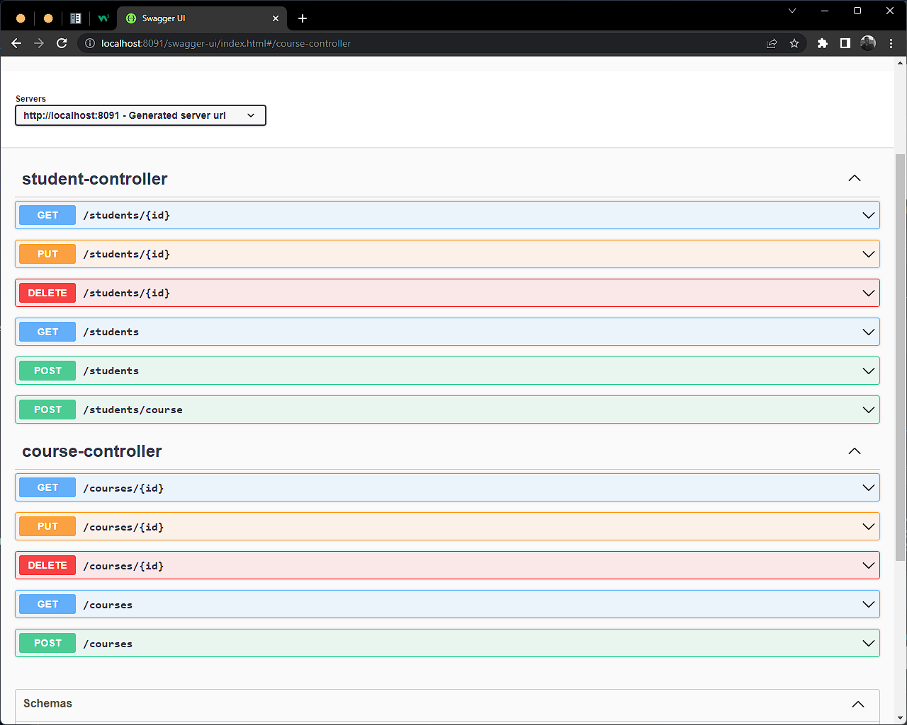

<!-- ABOUT THE PROJECT -->

## Enoca Java Hiring Challenge


### Kullanılan Teknolojiler

<a href="https://www.java.com/" target="_blank"></a><a href="https://spring.io" target="_blank"></a></a><a href="https://www.postgresql.org/" target="_blank"></a>     <a href="https://www.docker.com/" target="_blank"></a>
<a href="https://swagger.io/" target="_blank"></a>

### UML diagramı



### Proje Şeması


### Nasıl çalıştırılır
"/demo" klasörünün içindeyken komut satırından
```
mvn clean package -DskipTests
```
komutu çalıştırıldıktan sonra "/demo/target" klasörünün altında yine komut satırından
```
java -jar demo-0.0.1-SNAPSHOT.jar
```
komutu çalıştırılarak uygulama ayağa kaldırılabilir.

YA DA  
Çalıştırılacak makinede Docker yüklü ise
"/demo/src/main/docker" klasörünün içindeyken
```
docker compose -f docker-compose.yml up -d
```
komutu ile proje docker container'ında çalıştırılabilir.




## Lisans

MIT Lisansı altında dağıtıma açıktır. Daha fazla bilgi için `LICENSE.txt` dosyasını inceleyebilirsiniz.
Distributed under the MIT License. See `LICENSE.txt` for more information.


## İletişim

### Sami Sezgin

<a href="https://github.com/samisezgin" target="_blank">

</a>
<a href = "mailto:sezginsami@gmail.com?subject = Feedback&body = Message">

</a>
<a href="https://linkedin.com/in/samisezgin" target="_blank">

</a>  
